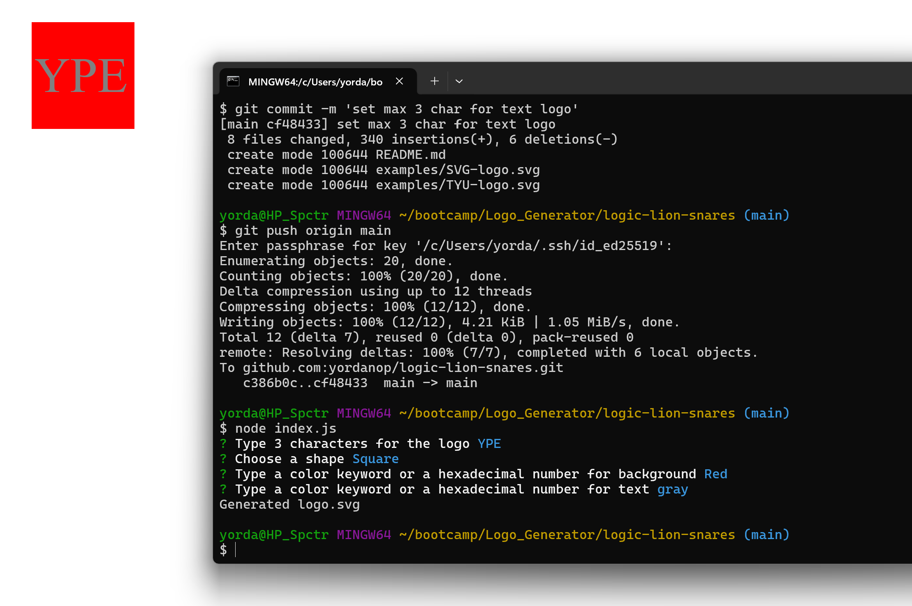

# Logo Generator
  
  ## Description

  This is an command-line application to generate svg files with a simple logo.

  https://drive.google.com/file/d/1B0cUwZS4rHGrr8Z4M5DrjG0pm0dE2ZXp/view

  

  ## Questions

  My email : yordanopv@gmail.com
  
  My Github page : https://github.com/yordanop

  ## Table of Contents

- [Installation](#installation)
- [Usage](#usage)
- [Credits](#credits)
- [License](#license)

## Installation

You need npm and from npm you need to install inquirer

## Usage

the app will ask for the background color, text shape and the color for the shape

## Credits

Instructor Chris and Alejandra Acosta

## License

   [MIT](https://choosealicense.com/licenses/mit/)

## Features

Simple and light application

  